## About

This document explains the exact steps necessary to integrate the **pdf417** scanner application with a example **Filemaker Pro** (and **Filemaker Go**) project via URL schema interop.

> Note: URL schema interop only works with the *Pro* version of the **pdf417** scanner application. Please contact us if you are interested in obtaining the **Pro** version of the barcode scanning application.

Using this approach you can easily integrate barcode scanning features into your **Filemaker Go** workflow on Apple's iPhone, iPod or iPad devices.

## Integration

For this example we will be using **Filemaker Pro 13** on **MacOS X**. The actions shown should be analogus to other versions of **Filemaker Pro**. Contact us if you need help with your version of the application.

We will go through the following steps to create a complete integration example:

+ Create a new template **Filemaker Pro** project for a *Inventory* item
+ Modify a form in the project to include a *Scan* button for invoking the barcode scanner
+ Add the necesary button click event code to transfer control to the scan application
+ Implement the **Filemaker Pro** script which will parse the result barcode data and insert it into a field on the form
+ Share the created form on the network to be able to access and test it via **Filemaker Go** running on a iPad device

### Create a new project

We will start by creating a new project from a starter template:

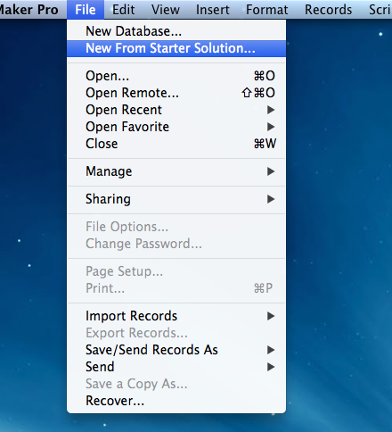

We choose the *Inventory* template:

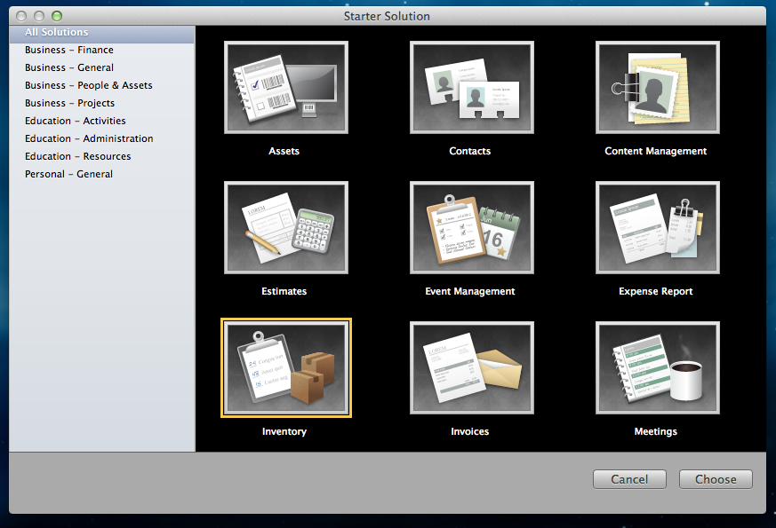

We can leave the default project name on the following screen:

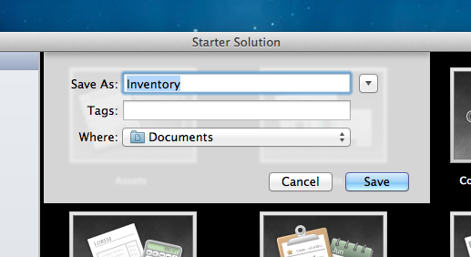

First thing we need to do in the new project once it opens is change the current view to *iPad Details* layout:

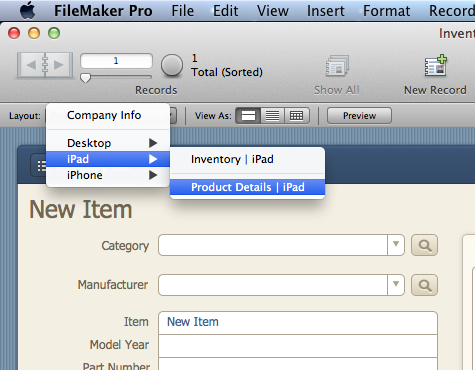

Now that we are in the *iPad Details layout* you can go into edit mode by pressing *Edit layout* so we can add our changes:

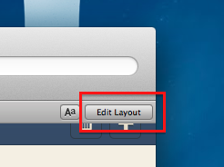

To add our scan button we first need to make some free space. Shrink the *Part Number* field to make space for a small button to the right of it:

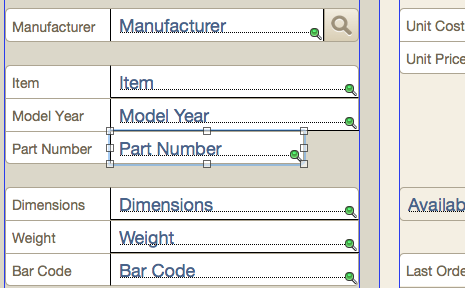

Now click on the button creation tool:

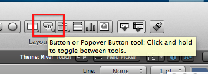

Add drag a button on the free space we made a bit earlier:

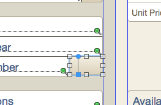

When you are finished dragging out the button a button setup dialog will open. Select that the button will *Open URL* (you can also check the *Perform without dialog* option to prevent a confirmation dialog poping up every time the button is pressed):

Clicking on *Specify* opens the URL dialog entry, click on *Specify* again to open a bigger dialog so we can enter the proper URL string more easily:

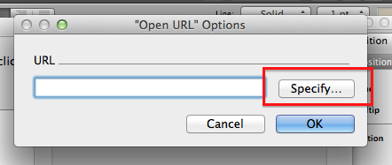

Now we need to define the invocation URL that will open the **pdf417** scanner application and tell it to give any barcode results to our **Filemaker Pro** form. More specificaly, to a processing script we will define later.

An example invocation URL is given here:

    "pdf417://scan?type=PDF417&text=true&fmp=true&beep=true&callback=" & GetAsURLEncoded ("fmp://" & Get (HostName) & "/" & GetAsURLEncoded(Get(FileName)) & ".fmp12?script=insert_barcode")

> Note: This is an example **Filemaker Pro** URL string for **pdf417**, some parts of it can be customised. Read the full URL schema documentation to figure out how you can adopt it to your needs.

Enter the URL string as shown in the following image:

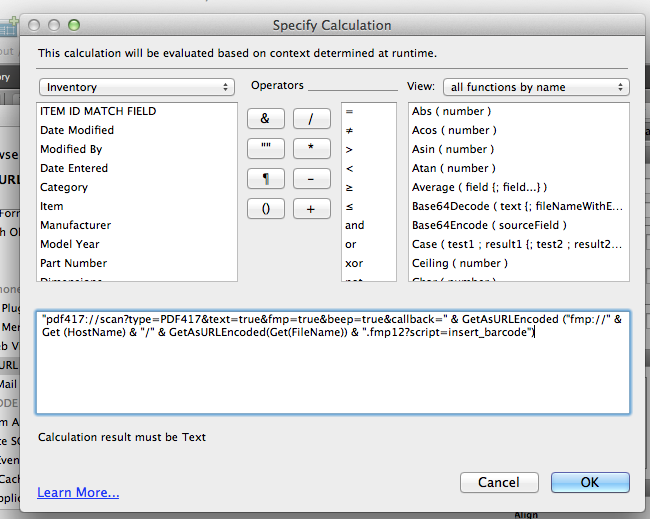

After you've closed the button setup dialog, give your button a label:

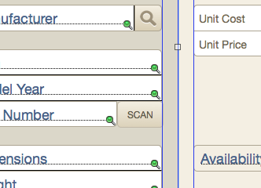

Now we are done as far as the scan button is concerned. The only thing left is to create the script which will parse the scan result. Open the script manager:

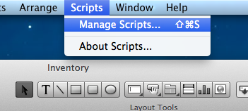

Create a new script by clicking on the *New* button:

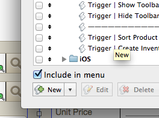

Name your script `insert_barcode` (this name is important, it must be the same name as used in the URL string that we entered a few steps earlier):

On the left side of the script editor select the *Insert Calculated Result* script action and click on *Move* to add it to the script:

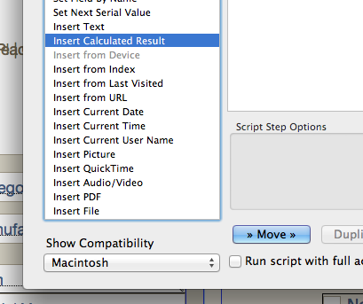

Now click on the first *Specify* button to select the field that will receive the scan result text:

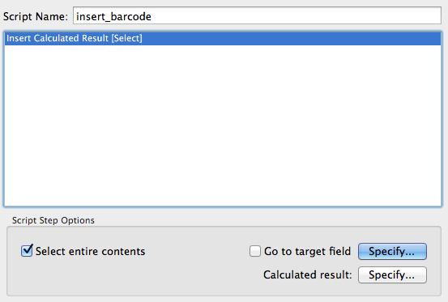

In our case we will select the *Part Number* field since that is the field next to which we placed our scan button:

Now click on the second *Specify* button to select the source of the data. The data is passed to the script as a parameter, so select *Get (ScriptParamter)* from the *Get functions* list:

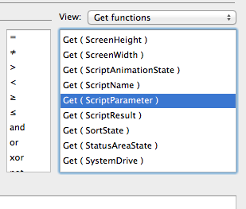

After properly selecting *Get (ScriptParamter)* the dialog shoult look like this:

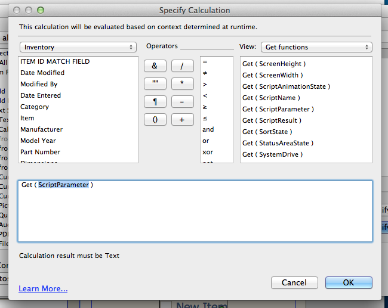

Our scan result processing script is now ready:

> Note: Here you would probably customise this script to your needs. In our example we just insert the textual data into a field on the form. You could for example do a record lookup with the scanned data, or fill multiple fields with the result, depending on your use-case.

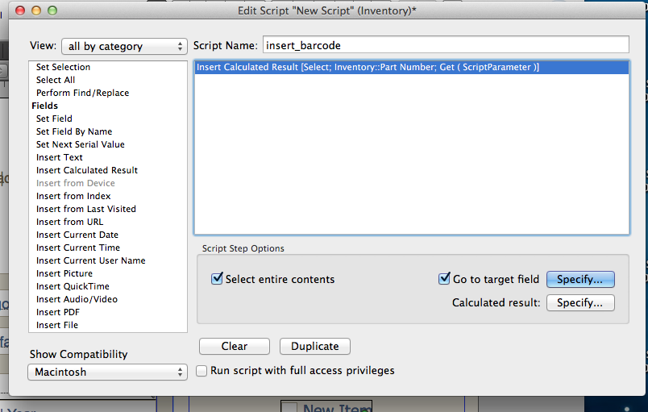

Upon trying to close the script editor **Filemaker Pro** warns us to save the script so we select *Save*:

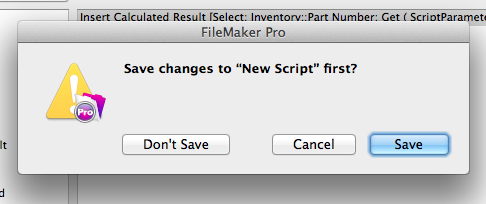

Our form is now ready, the only thing left to do is share it so that our **Filemaker Go** clients can access it:

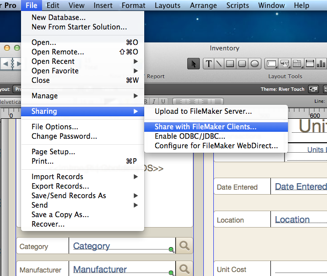

Make sure that *Network Sharing* is **On** and that privilages are set to *All users* (or whatever user privilege configuration you use in your environment):

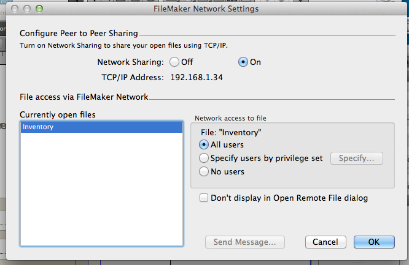

You can now go to your **Filemaker Go** application (in our case **Filemaker Go** on a iPad) and find the host computer sharing the previously made form:

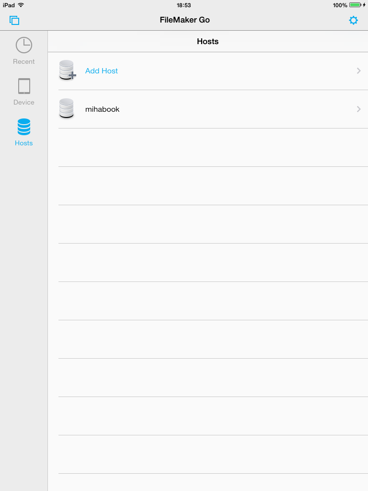

Selecting the host gives us a list of shared forms, we can now select our *Inventory* form:

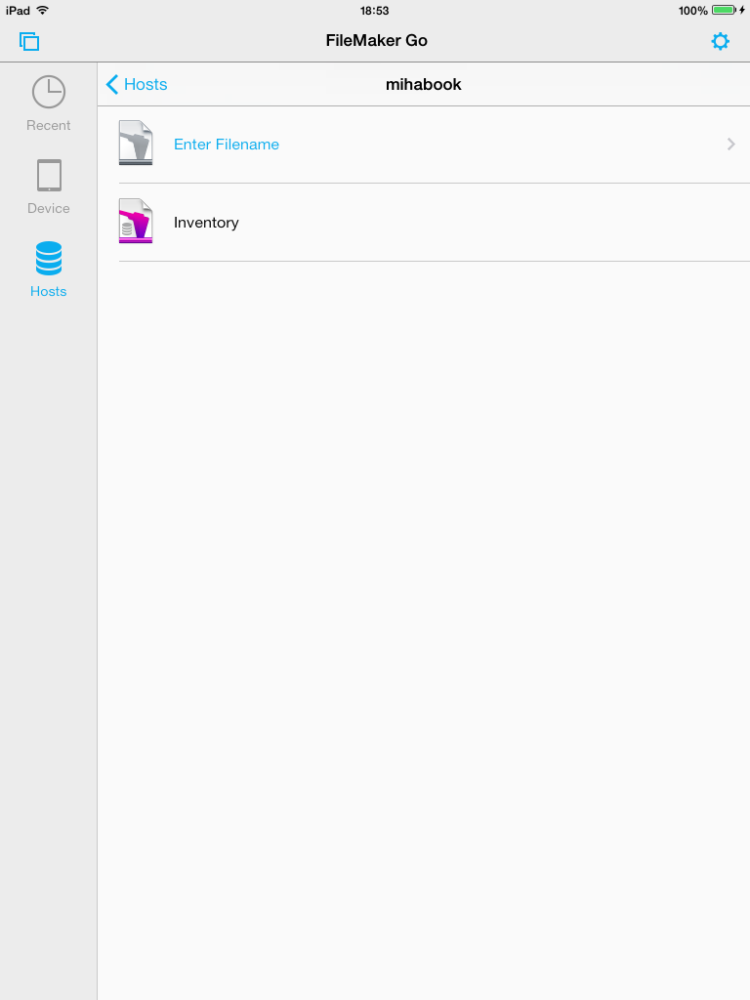

After clicking on *New Item* we are presented with our customized form:

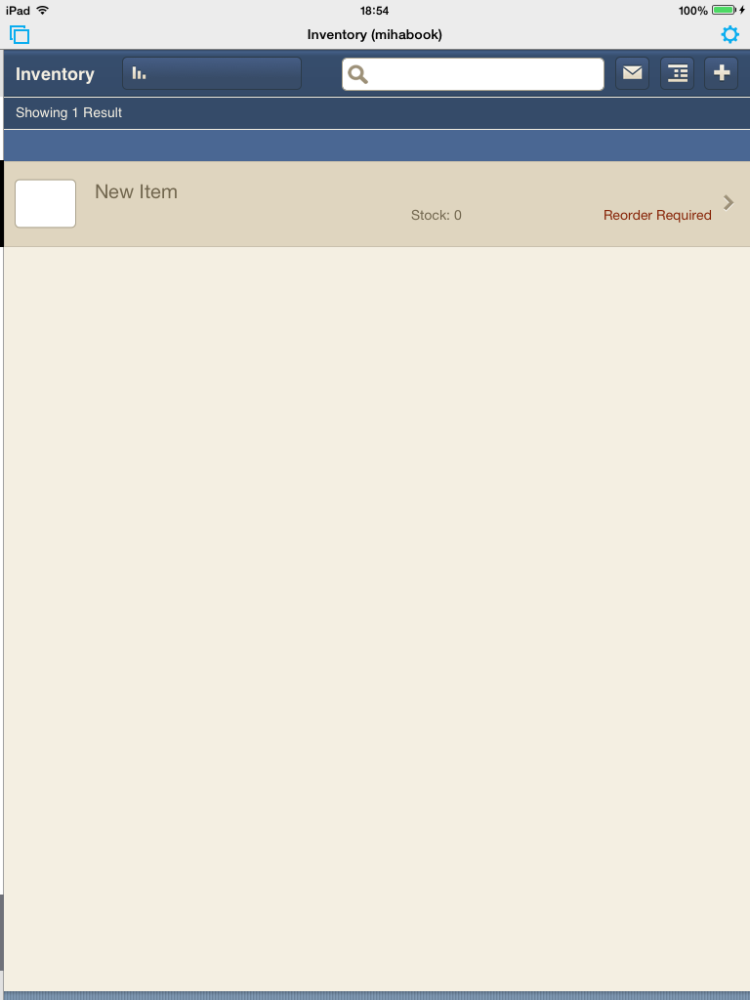

We can see the form contains our *Scan* button next to the *Part Number*. Clicking on the scan button launches the **pdf417** application in scan mode:

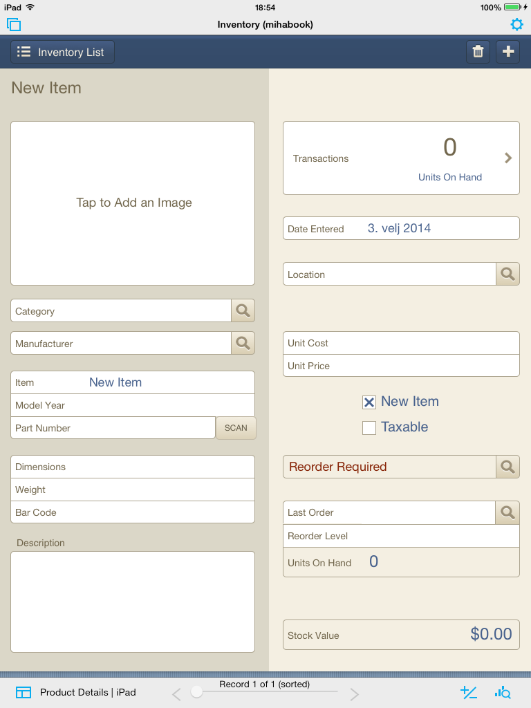

Point the device to a valid **pdf417** barcode and the application will scan it, returning the result to the **Filemaker Go** form:

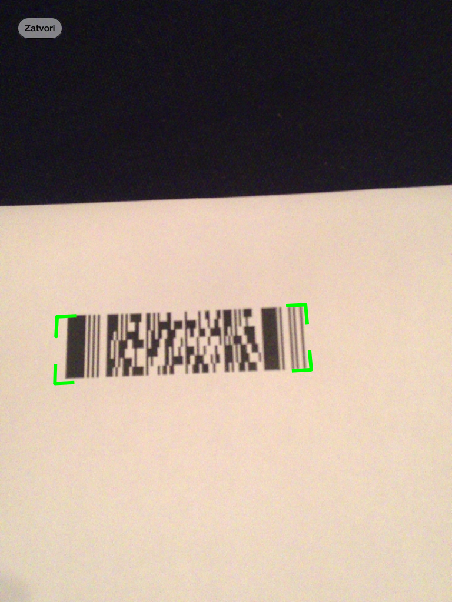

Our *Inventory* form in **Filemaker Go** automatically reopens and the *Part Number* field is now filled with the scanned data:

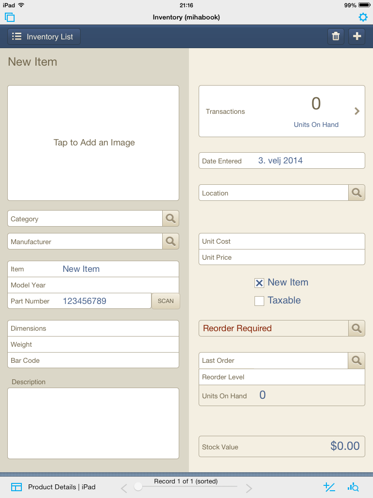

## Summary

We recommend you also read the general URL schema integration documentation to see the available options that can be customised when invoking the **pdf417** scanner this way. Just keep note that some parameters (like `text` and `fmt`) are required in order for **Filemaker Pro** integration to work properly.